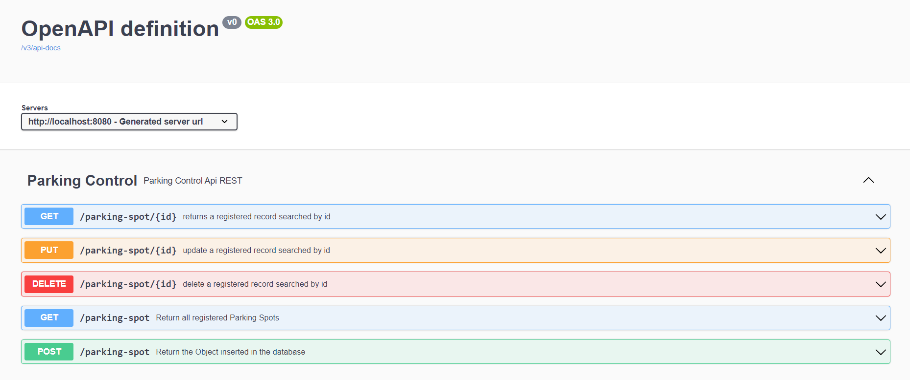

# Comece por aqui
### Principais ferramentas:

* Java JDK 17
* Spring 
* Spring WEB
* Spring Security
* PostgreSQL
* OpenAPI
* Insomnia / Postman

# Resumo

Este projeto é uma API REST que visa realizar o controle de vagas de estacionamento de um condomínio. Tal api possui os as principais operações para manipulação das informações "CRUD", ou seja, é possivel fazer operações de criação, leitura, atualização e deleção neste projeto. Para o controle dessas vagas atende-se alguns critérios essências para a alocação de um novo veículo a uma vaga, esses criterios são listados a seguir:

* Só é permitido cadastrar 1 veículo por vaga de estacionamento.
* Cada vaga de estacionamento está atrelada a um apartamento e bloco.
* O cadastro de um veículo em uma vaga só é permitido se todas as informações, como parkingSpotNumber,licensePlateCar,brandCar, modelCar, colorCar, responsableName, apartment e block, estiverem devidamente preenchidas.

# Segurança

Visando manter a aplicação segura foi aplicada a autenticação básica que requer usuário e senha para realizar operações do Controller referente ao Parking Control.

Tendo isso em vista, primeiramente, é necessário cadastrar os usuários utilizando os endpoints do UserController que, a titulo de aprendizagem, não requerem autenticação para serem manipulados. Após inserir usuários é necessário inserir manualmente no banco de dados as permissões e o relacionamento da permissão com o usuário, como no código SQL a seguir:

    INSERT INTO tb_role VALUES(gen_random_uuid(),'ROLE_ADMIN');
    INSERT INTO tb_role VALUES(gen_random_uuid(),'ROLE_USER');
    INSERT INTO tb_users_roles VALUES('id_do_usuario', 'Id_da_role');
    

Feito isso, basta realizar as requisições referentes ao parkingSpotController com a autenticação necessária, ou seja, passando os parâmetros de "username" e "password" na requisição.

# Documentação
Para se ter um controle efetivo das funcionalidades da api foi utilizado o OpenAPI para documentar os detalhes da API. Os endpoints estão devidamente documentados e suas funcionalidades são descritas utilizando essa ferramenta, basta executar a aplicação e abrir a seguinte URL: 
[http://localhost:8080/swagger-ui/index.html](http://localhost:8080/swagger-ui/index.html) .Feito isso, chegará numa página semelhante a imagem a seguir:

O method POST segue o seguinte modelo json para adicionar novos ParkingSpots ao banco de dados:

    {
        "parkingSpotNumber": "205F",
        "licensePlateCar": "RRS2025",
        "brandCar": "HONDA",
        "modelCar":"Civic",
        "colorCar": "black",
        "responsableName": "claudia",
        "apartment": "14",
        "block": "12"
        
    }